# Proyecto 1: Whack-a-mole

**Integrantes**

**Steven Sancho Orozco**  
*Escuela de Ingeniería Electrónica*
*Tecnológico de Costa Rica*  
Carné: 2019015506

Joan Franco Sandoval
Escuela de Ingeniería Electrónica
Tecnológico de Costa Rica
Carné: 2020248356

Brayan Díaz Ruiz
Escuela de Ingeniería Electrónica
Tecnológico de Costa Rica
Carné: 2018203585

Dennis Manuel Arce Alvarez
Escuela de Ingeniería Electrónica
Tecnológico de Costa Rica
Carné: 2018151568

*Fecha : 25/08/2026
---

## Introducción

El juego “Whack-a-mole” trata de intentar presionar un topo dentro de una ventana de tiempo, donde para la adaptación se generó mediante el uso de un circuito discreto compuesto por 8 LED´s funcionando como los “8 topos” y 8 botones asignados a cada LED, además se implementa la arquitectura necesaria para poder construir la lógica del juego mediante una FPGA y módulos, con reglas específicas.
Primeramente, no hay manera de “ganar” el juego, se registrarán los aciertos hasta 99, al igual que los fallos en dos display de 7 segmentos. Las posibles formas de obtener fallos en el juego son mediante time-out, donde se presiona la tecla de una forma tardía para la ventana de tiempo, que va a disminuir mientras más aciertos acumulados tenga el usuario y la otra forma de obtener fallos es presionando el botón incorrecto. En otro display de 7 segmentos se mostrará el conteo del acumulado de hasta 3 fallos consecutivos hará que se reiniciará el juego, los cuales van a estar mostrados, reiniciándose desde 0 después de cada acierto, limpiando todos los datos, por aparte se integra un botón de reset general para cuando se quiere reiniciar manualmente la partida.

--- 

## Fundamentación teórica

Para comprender la elaboración de la arquitectura y circuito para el juego Whack-a-mole es importante tener varios conceptos presentes.empezando por un modelado de comportamiento, el cual describe el funcionamiento del ciercuito, con la debida implementación, por otra parte está la estructura del diseño, la cual describe las conexiones físicas del diseño, ya sea como para la parte discreta como para la comunicación entre la FPGA y el circuito discreto.
Las buenas prácticas de diseño parten de un diseño modular donde se describe el proyecto a gran escala hasta llegar a la lógica detrás de cada módulo implementado con VIVADO, quien traduce la lógica en un circuito, los cuales cumplen funciones indispensables para el funcionamiento del juego, incluyendo lógica de máquinas de estados, decodificadores, debouncer entre otros, los cuales manejan señales físicas, funcionando bajo un reloj de la FPGA establecido en 100MHz, mientras en el ASIC la lógica está dad por compuertas que manejar la aleatoriedad del topo activo.
En el proyecto se construye un circuito  con una parte discreta la cual incluye compuertas, LED´s, botones y temporizadores, los cuales comunican datos con la parte digital del circuito, en la FPGA, la cual sioncroniza los pines de entrada y salida, las cuales van a ser el medio de trabajo de los módulos, recibiendo señales como las pulsaciones de los botones y el reset del juego y enviando señales de topo activo y puntaje de aciertos y fallos en los display de 7 segmentos.
Es necesario para la elaboración del juego Whack-a-mole diferenciar entre la máquina de estados finitos de Mealy y Moore. En el funcionamiento de una máquina de Moore, la salida solo depende del estado actual, mientras que el funcionamiento de una máquina de Mealy la salida depende del estado actual y las entradas 

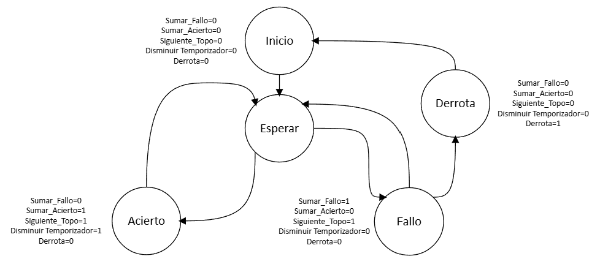

En este ejemplo de la máquina de Mealy se puede evidenciar la lógica principal del juego 

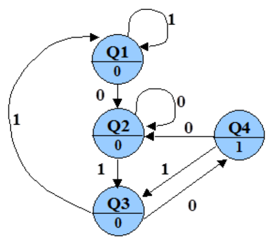

En la máquina de Moore se observa que cada estado ya cuenta con una salida previamente definida de acuerdo al estado en el que se encuentre. La máquina de estados va funcionar sin problema mientras se tenga un buen manejo de tiempos en el diseño de hardware, con el set up time, que es el tiempo mínimo en el que el dato a trabajar esté estable a diferencia del hold time, que es el tiempo en el que un dato debe de estar después de sun flanco. Además se debe tomar en cuenta los tiempos de propagación, que es el tiempo máximo que tarda una salida en reflejar el cambio y el tiempo de contaminación es el tiempo mínimo que tarda la salida en empezar a cambiar, ya que al no ser tomados en cuenta dentro del análisis, puede llegar a causar señales erróneas o desalineadas, también existe una ruta crítica entre los componentes físicos del bloque combinacionacional, donde se presenta el mayor tiempo de propagación entre el registro origen y el registro destino.
Dentro de la lógica de la FPGA se utiliza un mismo reloj par todos los sistemas digitales(módulos) mediante el uso de clk enable al memento de registrar el pulso de cada botón del sistema discreto el cual se llegará a leer y verificar el acierto contra el LED asignado al botón presionado, evitando múltiples relojes entre mósulos y perder la sincronía interna. Siguiendo con la lógica del botón, se implementó un módulo debouncer, para evitar multiples flancos de señal en la entrada, el cual al presionar solo reciba un cambio de estado y el módulo lo pueda procesar la información correspondiente, teniendo en cuenta que el sistema completo funcionamediante una comunicación asíncrona, donde existe el riesgo de metaestabilidad, la cual se logra reducir mediante el uso de dos flip-flops (con las señales button_sync_0 y button_sync_1)en cascada sincronizados con un mismo reloj dentro de la lógica del módulo.

Para el procesamiento de información se implenta un registro de desplazamiento, el cual está elaborado con una cadena de flip-flops y compuertas XOR la cual va moviendo los bits de información de una forma ordenada(tabs) la cual va a ser procesada por el receptor, escogiendo el bit que alimenta a la compuerta XOR, existen dos formas de enviar y recibir la inormación,  en el proceso de un serie-paralelo, los bits de información entran uno a uno con N cantidad de pulsos de reloj, seguidamente el receptor maneja el bloque de N bits para su debida necesidad y para un proceso paralelo-serie, se carga un dato de N bits el cual seguidamente el receptor irá sacando bit a bit, por cada pulso de reloj. Para el proyecto Whack-a-mole, se utiliza un proceso serie-serie, donde se implementa un decodificador, que tiene como función principal leer una palabra binaria de N bits     la traduce a una salida de 2N. 
Finalmente se utiliza un bloque UART para la comicación asíncrona entra la FPGA y el sircuito discreto, regulada por el baurate, que con 1 bit de inicio activa la lectura de los 8 bits de información y finalmente dedica otro bit para cerrar la lectura, bajo un acuerdo de tiempo de bit.

---

## Presentación y análisis de resultados

### Circuito discreto

El circuito se divide en dos etapas principales: la generación de números pseudoaleatorios y la transmisión serial de los datos hacia la FPGA.
Primera etapa: generador de números pseudoaleatorios
La primera etapa corresponde a un generador de números pseudoaleatorios implementado mediante tres flip-flops tipo D, los cuales se actualizan con una señal de reloj de aproximadamente 1 kHz. Los flip-flops se encuentran realimentados mediante una compuerta XOR, formando un registro de desplazamiento con realimentación (LFSR).
Este circuito genera continuamente una secuencia de valores de 3 bits. Mediante las entradas Preset de los flip-flops es posible introducir una condición inicial o semilla. Al modificar esta semilla se cambia el punto de inicio de la secuencia, permitiendo obtener diferentes sucesiones de valores. Aunque el comportamiento del circuito es determinista y eventualmente la secuencia se repite, la velocidad de actualización y el cambio de la semilla producen la percepción de que los números generados son aleatorios.
Segunda etapa: transmisión serial hacia la FPGA
La segunda etapa corresponde al sistema de transmisión serial tipo UART. Esta sección cuenta con tres registros encargados de capturar simultáneamente el valor presente en la salida del generador pseudoaleatorio. De esta manera, los registros funcionan como una especie de “fotografía” del número de 3 bits existente en un instante determinado, evitando que este cambie mientras está siendo transmitido.
La captura de los datos es controlada mediante una señal sincronizada con el funcionamiento del transmisor, pero independiente del reloj utilizado por el generador pseudoaleatorio. Una vez almacenado el número, los bits son enviados de forma serial hacia una única entrada de la FPGA.
Para controlar la transmisión se utiliza un contador conectado a una señal de reloj de aproximadamente 90 Hz. El contador completa un ciclo cada 9 pulsos de reloj y posteriormente se reinicia, definiendo de esta manera la duración de paquete de bits de transmisión.
El paquete incorpora inicialmente una secuencia de activación que permite a la FPGA reconocer el comienzo de una nueva transmisión. Mientras no se está enviando información, la línea permanece en el estado definido como inactivo. Cuando aparece el patrón de inicio establecido, por ejemplo 1-0, el módulo receptor de la FPGA identifica que comenzará una nueva trama y procede a capturar secuencialmente los tres bits correspondientes al número pseudoaleatorio.
Finalmente, debido a que la etapa discreta del circuito trabaja con niveles lógicos de 5 V, mientras que las entradas de la FPGA utilizan niveles de 3,3 V, las señales no se conectan directamente. Antes de ingresar a la FPGA, la señal serial pasa por un traductor de niveles lógicos (level shifter), encargado de convertir los niveles de 5 V a 3,3 V. Esto permite que la FPGA reciba e interprete correctamente los datos sin aplicar a sus entradas un nivel de tensión superior al permitido.

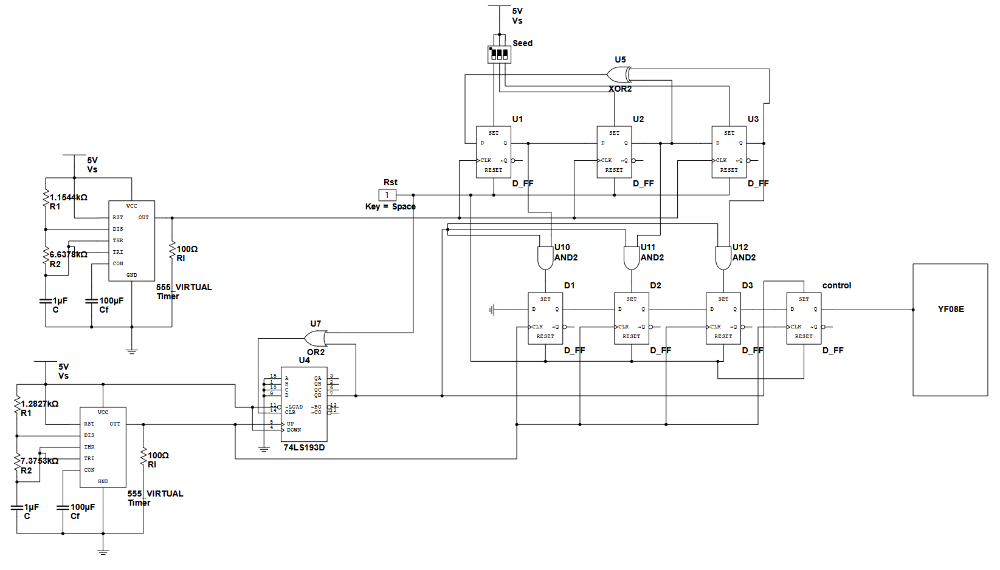

### Circuito digital y FPGA

#### Módulo receptor UART

Este módulo tiene como función principal generar adecuadamente una comunicación asincrónica entre el sistema discreto con el sistema digital, donde ambas parte funcionan con relojes a diferentes frecuencias y sin sincronizar, este módulo logra su funcionamiento con el Badu rate acordado, que quedó en 90Hz, el cual acepta una trama con un bit de inicio que activa la lectura en la FPGA, luego la parte digital logra leer los 8 bits de información(cuál botón se presionó) y finalmente un bit de cierre para que la FPGA deje de leer información, impidiendo registrar datos erróneos para el funcionamiento adecuado entre sistemas.
para este módulo se generaron diferentes pruebas donde se asigna uno de los LED´s y un botón en estado activo, para así verificar cuál fue el registro enviado a la FPGA, seguidamente se presentan algunos resultados del test bench del módulo.

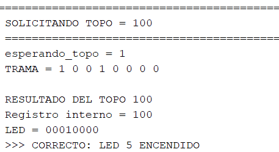

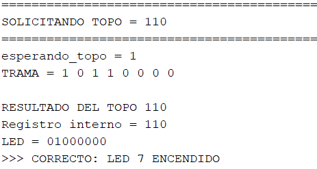

#### Módulo button_debouncer_receptor

Para el módulo antirebotes, maneja las señales de botones, que es la pulsación directa del botón físico, otra señal de debounce_counter, que acumula hasta 20 ms que ve de la mano con la señal de botón_presionado, que maneja la actualización retardada de los flancos del botón, reduciendo el ruido en la lectura del botón, evitando el registro múltiples inputs que llegarían a generar múltiples fallos. Su función con respecto al clk va a ser una señal en 1, siendo esta desde el momento en el que se presiona el botón físico y su señal es registrada por el módulo, bajando a 0 después de un ciclo de reloj como se muestra en la imagen a continuación.

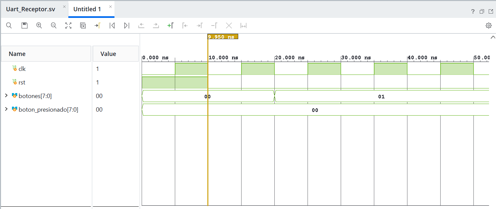

#### Módulo verificador de golpe

En este módulo(hit_verifier) se trabaja la lógica de acierto o fallo al haber presionado un botón, tiene como señales de entrada el reloj de la FPGA, una señal de reset, seguidamente las señales a procesar son “targer_active”, la cual verifica si el hit a botón se registra dentro de la ventana de tiempo del topo activo y finalmente la señal de “button_press” que es enviada desde el módulo button_debouncer_receptor, en la salida se obtiene la señal de “hit_valid” que toma como correcto o incorrecto el hit y otra señal de “miss_flag”, señalando un fallo, las 4 señales anteriormente mencionadas tienen un tamaño de 1b.

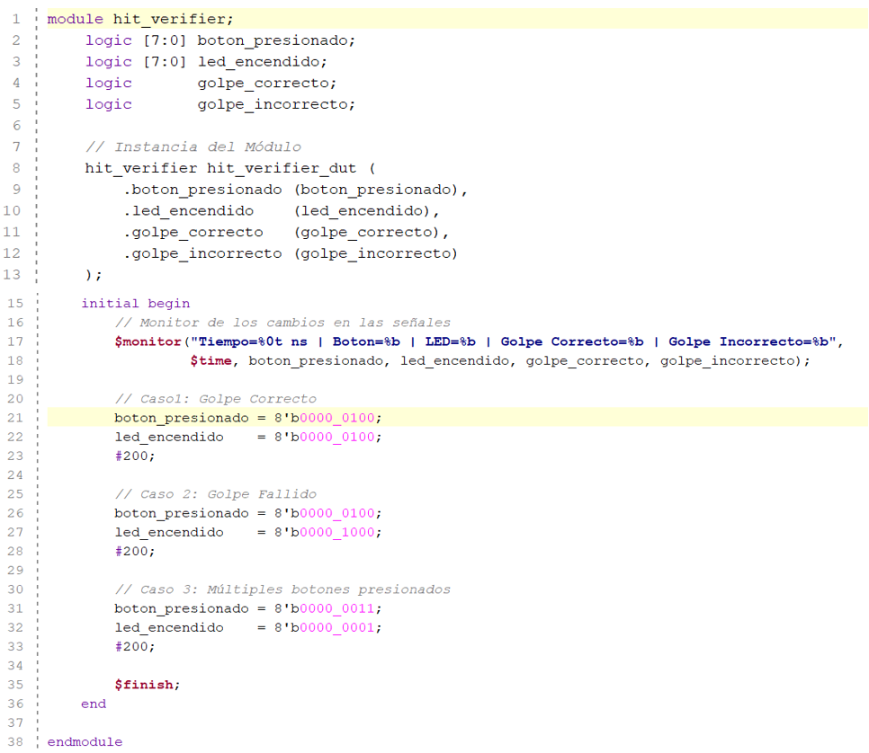

En el test bench se describe tres casos que pueden llegar a suceder, golpe correcto, donde la señal boton_presionado y led_encendido(señales de verificación/comparador) tiene el mismo dato de 8b, en segundo lugar un golpe erróneo, dado cuando la información de las dos señales de verificación son diferentes, la diferencia entre estas dos pruebas y la tercera, múltiples botones presionados es la cantidad de “altos” en la señal dada por boton_presionado, generando un error en el juego.

#### Módulo de máquina de estados

Como bien se sabe, una máquina de estados la cual al manejar datos de información esta debe tener una señal de entrada de reset para limpiar sus datos e iniciar una nueva ronda de datos, el módulo cuenta con un detector e flancos mediante la señal de “golpe_correcto”, se tienen señales de control que duran un ciclo de reloj de la FPGA como las señales “sumar_acierto”, “disminuir_temporizador”. Por otra parte, existen señales que también controlan la dinámica de los fallos en el juego, la señal “timeout” genera “sumar_fallo” y “siguiente_topo”, la señal “tres_fallos” está directamente relacionada con la señal de “derrota”, la cual funciona como un enable para la señal de reset.

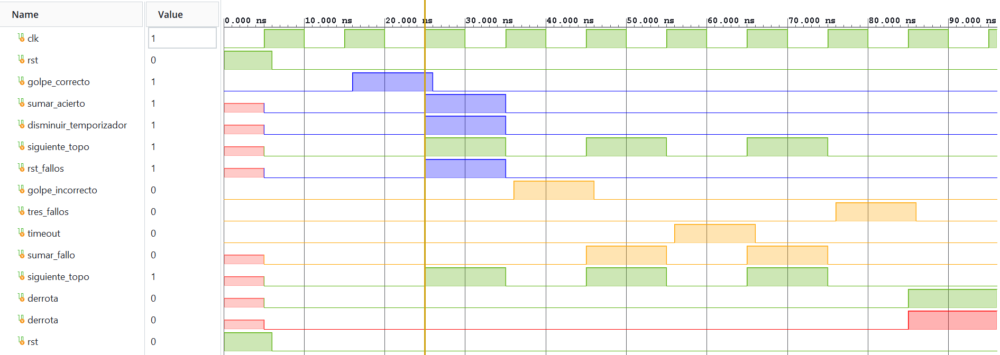

En la Ventana del Waveform se observa claramente el flujo del juego Whack-a-mole, con la señales de acierto y sumar puntos en azul, las señales de fallo o acumulación de puntos están de color amarillo y finalmente con una señal de derrota en rojo.

#### Módulo de máquina de estados

En el momento de iniciar una partida se aclara que al acumular aciertos las ventanas de tiempo entre topos se irán reduciendo de 2s hasta los 0.5s, con saltos específicos de 100ms entre nivel con un total de 10 niveles de dificultad, este requisito lo satisface el módulo Timer.sv, el cual cambia los niveles de dificultad con un comparador y un contador para verificar cuando reducir la ventana de tiempo.

#### Módulo de rastreo de puntajes

Tomando en cuenta la función del módulo verificador de golpe, la señal de salida “golpe_correcto” o “golpe_incorrecto” definirán el rumbo de este módulo, ya que existen 3 registros principales en el módulo que van a funcionar como acumuladores, primero un indicador para los aciertos acumulado, luego otro para el acumulado de fallos y uno final el cual contará exclusivamente el acumulado de hasta 3(condición de derrota)

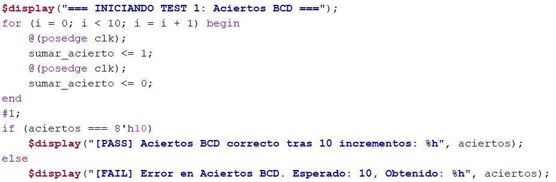

En este test se encarga del conteo de aciertos, tomando en cuenta el acarreo por el convertidor BCD, el cual llega a un límite de 99.

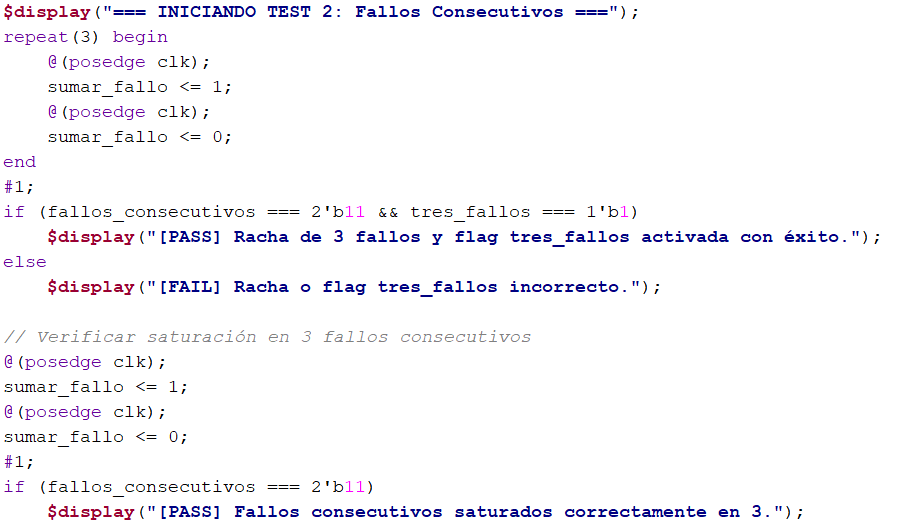

Para el Segundo test se prueban los fallos consecutivos y en el bloque final se especifica el acumulado de hasta 3 fallos, que genera un flag de derrota.

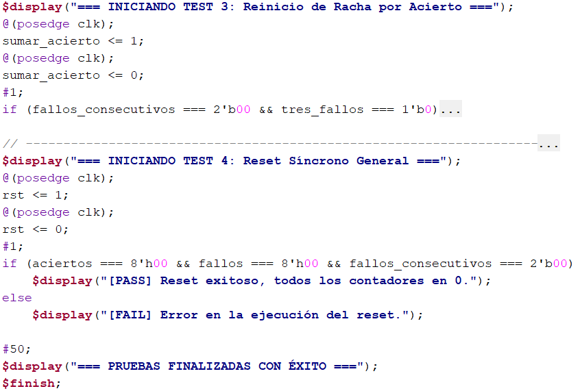

Finalmente para el caso 3 donde se prueba la limpieza de fallos consecutivos después de un acierto. Para todas las pruebas están controladas y sincronizadas por un reloj interno fijo para todos los módulos. 

#### Módulo de 7 segmentos

El módulo display_7seg_mux maneja las señales dadas por el módulo de rastreo de puntajes, donde en dos display de 7 segmentos se muestra la información del puntaje en aciertos, fallos y acumulado de hasta 3 fallos, este módulo es esencial para la debida visualización del transcurso de la partida.
En el testbench se prueban diferentes combinaciones entre cantidad de acuerti y cantidad de fallos, asegurando un buen funcionamiento, como se muestra en las siguientes imágenes, validando diferentes marcadores.

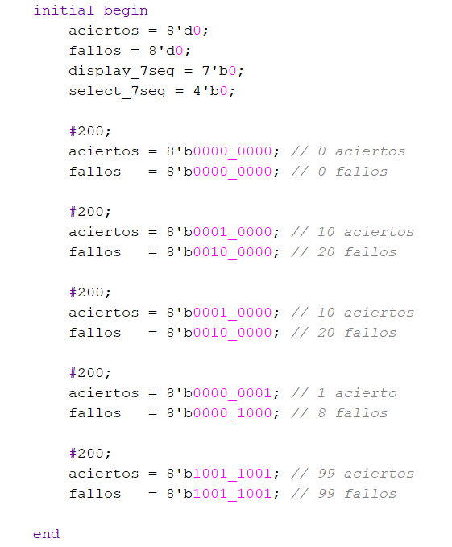

#### Módulo de LED de estado

Este es un módulo pequeño que tiene como función principal comunicar al jugador que su partida ha finalizado y que el juego se va a reiniciar por medio de una señal de reset.

#### Módulo TOP

En este módulo se implementan todos los módulos creados y mencionado hasta este punto, el módulo Top, es el ecnargado de unificar cada subsistema en un sistema única, el cual relaciona las entradas y salidas entre módulos, también se encarga de la lectura y activación de cuando leer y registrar un dato, mediante el flujo de la máquina de estado. Este módulo genera la funcionalidad completa del juego Whack-a-mole.

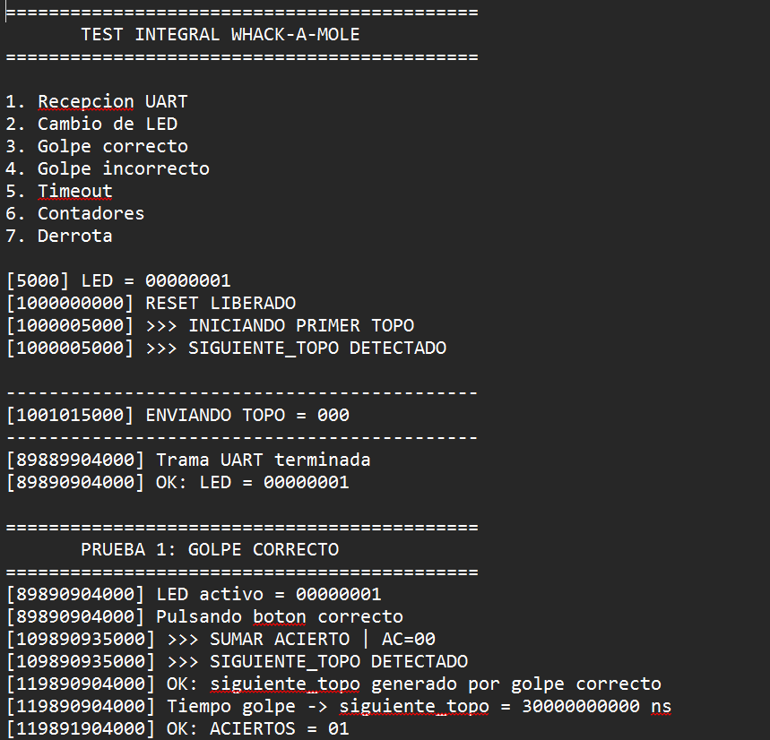

Para esta primer imagen, la prueba parte de los 7 estados que debe recorrer la lógica, con parámetros previamente definidos, iniciando el proceso con el LED de activación, junto con el topo enviado, además también se asume un golpe correcto.

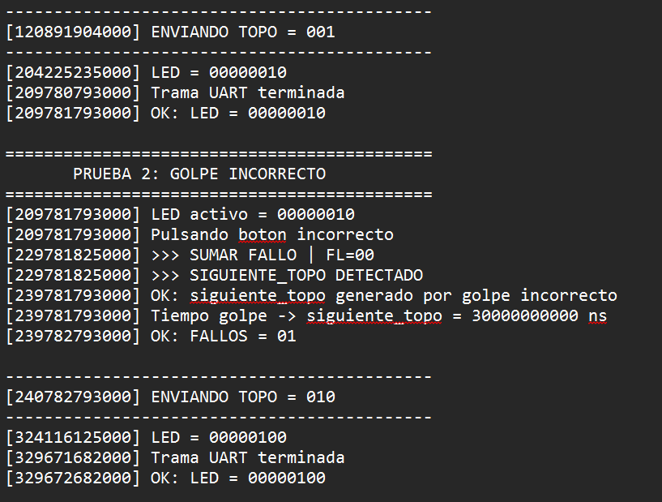

En la segunda parte de resultados del testbench se tiene que hay un golpe incorrecto confirmado y la activación del siguiente topo a encender.

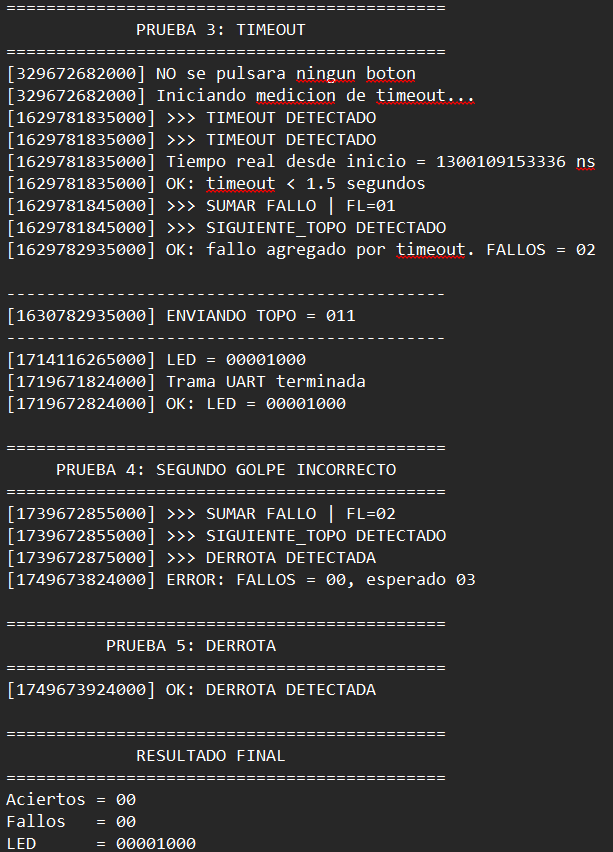

Finalmente se analiza una forma de fallo, que es a través de time out, el cual genera un fallo acumulado en los dos contadores de fallos existentes, seguidamente se prueba con un segundo fallo y para concluir en derrota se genera un tercer fallo activando la señal de derrota y reinicio del juego, elminando y reescribiendo todos los datos a 0.

---

### Conclusión

El desarrollo del proyecto permitió integrar satisfactoriamente conceptos de electrónica digital, programación de FPGA y comunicación serial para implementar un juego de Whack-a-Mole utilizando la tarjeta Nexys 4 y un circuito discreto. Se logró diseñar una arquitectura en la que los topos eran generados mediante un LFSR implementado en el circuito discreto y posteriormente enviados hacia la FPGA mediante comunicación UART, donde fueron procesados mediante módulos desarrollados en SystemVerilog y Vivado. Además, se implementaron las mecánicas principales del juego, incluyendo la detección de aciertos y fallos, el cambio de topo, el control mediante botones y la condición de derrota después de tres fallos consecutivos. La lógica de derrota también permitió conservar temporalmente los resultados durante dos segundos antes de reiniciar el juego, cumpliendo con el comportamiento planteado inicialmente.

Uno de los principales retos del proyecto fue la integración entre las diferentes partes del sistema. La etapa inicial de diseño requirió una cantidad considerable de tiempo para definir cómo se comunicarían el circuito discreto y la FPGA y cómo se distribuirían las responsabilidades entre los distintos módulos. Asimismo, fue necesario realizar múltiples correcciones a los testbenches hasta conseguir que representaran correctamente el comportamiento esperado. La falla del oscilador 555 utilizado originalmente obligó además a utilizar un generador de señales como alternativa para continuar con las pruebas. A pesar de estas dificultades, al realizar la integración completa del proyecto se obtuvo un funcionamiento correcto durante las pruebas previas a la entrega. Sin embargo, durante la demostración final se presentó un problema inesperado en la transmisión serial, en la cual un bit no estaba siendo enviado correctamente. Esto afectó el funcionamiento del sistema y representó una oportunidad para identificar la importancia de realizar pruebas de integración y validaciones adicionales inmediatamente antes de una demostración.

Entre los principales aprendizajes obtenidos destaca la comprensión práctica de los protocolos de comunicación UART, especialmente la importancia de establecer correctamente la temporización, el orden de los bits y la sincronización entre el transmisor y el receptor. También se fortaleció el conocimiento sobre el diseño modular en SystemVerilog, la elaboración y depuración de testbenches y la integración entre hardware discreto y lógica programable. Finalmente, el proyecto permitió desarrollar habilidades de trabajo colaborativo mediante el uso de GitHub, issues y pull requests, facilitando la división de tareas y la integración del trabajo de los integrantes. En conjunto, la experiencia demostró que un sistema puede funcionar correctamente a nivel individual y durante las pruebas de desarrollo, pero que la validación de la integración completa y bajo las mismas condiciones de la entrega es igualmente fundamental para garantizar su confiabilidad.

---

### Referencias

1. David Harris y Sarah Harris. Digital Design and Computer Architecture. RISC-V
Edition. Morgan Kaufmann, 2022, p ´agina 564. ISBN: 978-0-12-820064-3
2. Pong P. Chu. FPGA Prototyping by SystemVerilog Examples. Wiley, 2018, p ´agi-
na 656. ISBN: 978-1-119-28266-2.