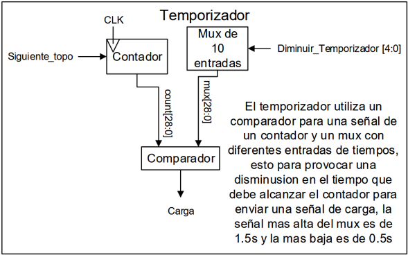
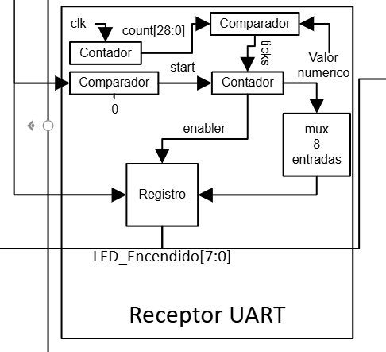
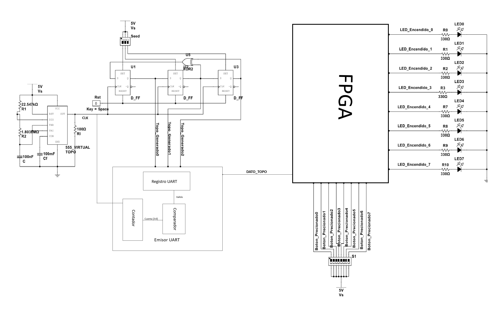

# Diseño de Juego Whack-a-Mole (FPGA / Lógica Discreta)

## Primer Nivel: Descripción General del Sistema

En este primer nivel describe la función básica del circuito como juego de Whack-a-mole, partiendo de un circuito que tiene como entradas 8 botones los cuales controlan el desarrollo de la partida y una señal de reset general y mediante un circuito discreto encargado de generar la posición de los topos en la salida se estaría reflejando dos señales principales, una para un arreglo de LED´s (ON=topo activo) y un display de 7 segmentos para poder visualizar tanto los aciertos acumulados a lo largo de la partida como los fallos seguidos


---

## Segundo Nivel: Arquitectura de Subsistemas

Para el diagrama de segundo nivel se manejan dos señales de CLK independientes, uno para el circuito discreto generado con un 555 que tiene como función principal controlar e indicar cuando se activa un botón(los cuales están asignados al “topo activo dados por los LEDs”) y otro CLK para la FPGA establecido en 100MHz, el cual controla e brinda las señales de activación de los LEDs(“topos”)


## Cuarto Nivel


### Generador pseudoaleatorio de 3 bits

#### a) Diagrama / Diseño 

Este módulo corresponde al bloque encargado de generar la posición pseudoaleatoria utilizada posteriormente por el sistema para determinar cuál topo debe activarse.


#### b) Objetivo del módulo

El objetivo de este módulo es generar de manera continua una **secuencia binaria pseudoaleatoria de 3 bits**, la cual será utilizada por los módulos posteriores del sistema para seleccionar la posición del topo que debe activarse.

Para generar esta secuencia se utiliza un registro de desplazamiento con realimentación lineal (**LFSR**) compuesto por tres flip-flops tipo D y una compuerta XOR. La actualización de los estados se realiza mediante una señal de reloj producida por un temporizador 555.

Las entradas `Seed_0`, `Seed_1` y `Seed_2` permiten establecer un estado inicial en el registro, mientras que `Rst` permite reiniciar los flip-flops.

#### c) Entradas

| Entrada | Descripción |
|---|---|
| `Seed_0` | Permite establecer el estado inicial del flip-flop `U1`. |
| `Seed_1` | Permite establecer el estado inicial del flip-flop `U2`. |
| `Seed_2` | Permite establecer el estado inicial del flip-flop `U3`. |
| `Rst` | Señal de reinicio común para los tres flip-flops. |

Adicionalmente, el módulo utiliza una alimentación de **5 V** para el circuito discreto.


#### d) Salidas

| Salida | Descripción |
|---|---|
| `Q0` | Bit almacenado en el flip-flop `U1`. |
| `Q1` | Bit almacenado en el flip-flop `U2`. |
| `Q2` | Bit almacenado en el flip-flop `U3`. |

Las tres señales en conjunto forman la salida pseudoaleatoria:

`Q2 Q1 Q0`

Esta combinación binaria representa el estado actual del generador y puede ser utilizada por los siguientes módulos para determinar la posición correspondiente al topo activo.

#### e) Relación con otros módulos

El generador pseudoaleatorio funciona como la fuente de selección de posiciones para el resto del sistema. Su salida de 3 bits es enviada al módulo encargado emisor del UART que enviara la informacion de manera serial al registro del receptor UART dentro de la fpga.

De esta manera, este módulo no activa directamente los LEDs, sino que proporciona el valor pseudoaleatorio utilizado posteriormente para seleccionar cuál de las posiciones disponibles debe representar al **topo activo**.


Por su parte, el temporizador 555 genera de forma independiente la señal de reloj requerida por el registro de desplazamiento, por lo que la velocidad con la que cambia el valor pseudoaleatorio depende de la frecuencia configurada en este temporizador.

#### f) Explicación de funcionamiento

El circuito está constituido por un temporizador 555, tres flip-flops tipo D (`U1`, `U2` y `U3`) y una compuerta XOR (`U5`).

El temporizador 555 funciona como generador de reloj. Su salida se encuentra conectada a las entradas de reloj de los tres flip-flops, permitiendo que todos actualicen su estado de forma sincronizada con cada pulso.

Los tres flip-flops forman un registro de desplazamiento. La salida `Q` de `U1` se conecta a la entrada `D` de `U2`, mientras que la salida `Q` de `U2` se conecta a la entrada `D` de `U3`. Por lo tanto, en cada pulso de reloj los bits almacenados se desplazan de una etapa hacia la siguiente.

La entrada del primer flip-flop `U1` se obtiene mediante la realimentación producida por la compuerta XOR `U5`. Esta compuerta recibe como entradas los estados correspondientes a `U2` y `U3`.

Por lo tanto, el estado siguiente del registro puede expresarse como:

```text
Q0(n+1) = Q1(n) XOR Q2(n)
Q1(n+1) = Q0(n)
Q2(n+1) = Q1(n)
```


### Indicador de posición mediante LEDs

#### a) Diagrama modular / Diseño 

Este módulo corresponde al bloque encargado de representar visualmente la posición del topo activo mediante un arreglo de 8 LEDs controlados individualmente por la FPGA.


#### b) Objetivo del módulo

El objetivo de este módulo es indicar visualmente cuál de las **8 posiciones posibles del topo** se encuentra activa durante el desarrollo de la partida.

Para realizar esta función se utilizan 8 LEDs independientes, donde cada LED representa una posición diferente dentro del juego. La FPGA controla individualmente cada una de las salidas, permitiendo encender únicamente el LED correspondiente a la posición seleccionada.

Cada LED se conecta en serie con una resistencia de **330 Ω**, utilizada para limitar la corriente que circula a través del dispositivo y proteger tanto el LED como la salida de la FPGA.

#### c) Entradas

| Entrada | Descripción |
|---|---|
| `LED_Encendido_0` | Señal de control proveniente de la FPGA para activar el LED 0. |
| `LED_Encendido_1` | Señal de control proveniente de la FPGA para activar el LED 1. |
| `LED_Encendido_2` | Señal de control proveniente de la FPGA para activar el LED 2. |
| `LED_Encendido_3` | Señal de control proveniente de la FPGA para activar el LED 3. |
| `LED_Encendido_4` | Señal de control proveniente de la FPGA para activar el LED 4. |
| `LED_Encendido_5` | Señal de control proveniente de la FPGA para activar el LED 5. |
| `LED_Encendido_6` | Señal de control proveniente de la FPGA para activar el LED 6. |
| `LED_Encendido_7` | Señal de control proveniente de la FPGA para activar el LED 7. |

Cada entrada corresponde a una salida digital independiente de la FPGA.

#### d) Salidas

Las salidas de este módulo son de tipo visual. El LED encendido representa directamente la posición en la que se encuentra el topo activo durante la partida.

#### e) Relación con otros módulos

Este módulo se encuentra directamente relacionado con el sistema de control implementado en la FPGA. La FPGA recibe la información correspondiente a la posición que debe ocupar el topo y, a partir de esta información, genera las señales `LED_Encendido_0` hasta `LED_Encendido_7`.

Cada una de estas señales controla una posición específica del arreglo de LEDs. De esta manera, el valor de posición determinado por los módulos anteriores se transforma en una indicación visual para el jugador.

El módulo también se relaciona indirectamente con el sistema de botones del juego, ya que el LED activo determina cuál de los botones debe presionar el jugador para registrar un acierto.

#### f) Explicación de funcionamiento

El circuito está compuesto por **8 LEDs**, cada uno conectado a una salida independiente de la FPGA mediante una resistencia de **330 Ω**.

Cada señal `LED_Encendido_n` controla directamente el LED asociado a la posición `n`. Cuando la FPGA coloca una de estas señales en nivel lógico alto, circula corriente desde la salida de la FPGA a través de la resistencia de 330 Ω y posteriormente a través del LED hacia tierra.


### Administrador de puntajes

#### a) Diagrama modular

Este módulo corresponde al bloque encargado de administrar los **aciertos, fallos totales y fallos consecutivos** producidos durante la partida. Además, permite determinar cuándo el jugador alcanza tres fallos consecutivos para generar una señal hacia el controlador principal.


#### b) Objetivo del módulo

El objetivo del módulo es llevar el registro de los resultados obtenidos por el jugador durante la partida.

El administrador mantiene tres valores principales: la cantidad de **aciertos acumulados**, la cantidad de **fallos acumulados** y la cantidad de **fallos consecutivos**.

Los valores correspondientes a los aciertos y fallos acumulados son enviados al sistema de visualización mediante displays de 7 segmentos. Por otra parte, el registro de fallos consecutivos es comparado con el valor `3` para determinar cuándo el jugador ha cometido tres fallos consecutivos.

Cuando esta condición se cumple, el módulo genera la señal `3_fallos`, que es enviada al controlador principal para indicar que debe finalizar o reiniciar la partida.

#### c) Entradas

| Entrada | Descripción |
|---|---|
| `Sumar_acierto` | Señal que indica que el jugador acertó la posición del topo y que debe incrementarse el registro de aciertos. |
| `Sumar_fallo` | Señal que indica que el jugador cometió un fallo y que deben actualizarse los registros correspondientes. |
| `Rst` | Señal utilizada para reiniciar los registros del administrador de puntajes. |

####d) Salidas

| Salida | Descripción |
|---|---|
| `Aciertos` | Valor almacenado en el registro de aciertos y enviado al sistema de visualización de 7 segmentos. |
| `Fallos` | Valor almacenado en el registro de fallos y enviado al sistema de visualización de 7 segmentos. |
| `3_fallos` | Señal que indica que se han alcanzado tres fallos consecutivos. |

El registro de fallos consecutivos se utiliza internamente para determinar la condición de tres fallos y no necesita mostrarse directamente en los displays.

#### e) Relación con otros módulos

El administrador de puntajes recibe las señales `Sumar_acierto` y `Sumar_fallo` provenientes del módulo encargado de determinar si la acción realizada por el jugador corresponde a un acierto o a un fallo.

Cuando se recibe `Sumar_acierto`, el módulo actualiza el registro de aciertos y reinicia el conteo de fallos consecutivos, debido a que un acierto interrumpe la secuencia de fallos.

Cuando se recibe `Sumar_fallo`, se incrementa tanto el registro de fallos acumulados como el registro de fallos consecutivos.

Los registros de aciertos y fallos se conectan con el módulo encargado de controlar los displays de 7 segmentos, permitiendo visualizar el puntaje durante la partida.

Por otra parte, el registro de fallos consecutivos se conecta internamente con un comparador. Cuando este registro alcanza el valor `3`, se genera la señal `3_fallos`, la cual es enviada al controlador principal para indicar que se ha alcanzado la condición de finalización correspondiente.

#### f) Explicación de funcionamiento

El módulo utiliza tres registros independientes para almacenar los resultados de la partida:

- **Registro de aciertos:** almacena la cantidad total de aciertos realizados por el jugador.
- **Registro de fallos:** almacena la cantidad total de fallos realizados durante la partida.
- **Registro de fallos consecutivos:** almacena únicamente la cantidad de fallos realizados de manera consecutiva.

Cada registro posee un sumador asociado. La salida actual del registro se realimenta hacia su respectivo sumador, permitiendo incrementar el valor almacenado cuando se recibe la señal correspondiente.

Cuando `Sumar_acierto` se activa, el registro de aciertos incrementa su valor en una unidad:

```text
Aciertos(n+1) = Aciertos(n) + 1
```

Al mismo tiempo, el registro de fallos consecutivos se reinicia, ya que el acierto rompe la secuencia de fallos consecutivos.

Cuando Sumar_fallo se activa, se incrementa el registro de fallos totales:

```text
Fallos(n+1) = Fallos(n) + 1
```

También se incrementa el registro de fallos consecutivos:

```text
Fallos_consecutivos(n+1) = Fallos_consecutivos(n) + 1
```

El valor almacenado en el registro de fallos consecutivos se conecta a un comparador, el cual lo compara constantemente con el valor binario:

```text
3 = 2'b11
```
Cuando ambos valores son iguales, el comparador activa la señal, esta señal es enviada al controlador principal para indicar que el jugador ha alcanzado tres fallos consecutivos.

Por lo tanto, el módulo no solamente lleva el puntaje general de la partida, sino que también permite detectar una de las condiciones utilizadas para determinar su finalización.

#### g) Diseño
##Tabla de verdad de aciertos
Tabla de acierto
| Estado actual | Acierto | Siguiente estado | Acción | 
| ------------ | ------------ | ------------ | ------------ | 
| 00      | 0      | 00      | Inicio      | 
| 00      | 1      | 01      | Incremento en 1      | 
| 01      | 0      | 01      | Mantiene el valor      | 
| 01      | 1      | 10      | Incremento en 1      | 
| 10      | 0      | 10      | Mantiene el valor      | 
| 10      | 1      | 11      | Incremento en 1      | 

##Tabla de verdad de fallos

| Estado actual | Acierto | Fallo | Siguiente estado | Acción |
| ------------ | ------------ | ------------ | ------------ | ------------ |
| 00 | 0 | 0 | 00 | Inicio |
| 00 | 1 | 0 | 00 | Mantiene el valor |
| 00 | 0 | 1 | 01 | Incremento fallo en 1 |
| 01 | 1 | 0 | 00 | Reset de fallo acumulado |
| 01 | 0 | 1 | 10 | Incremento fallo en 1 |
| 10 | 1 | 0 | 00 | Reset de fallo acumulado |
| 10 | 0 | 1 | 11 | Incremento fallo en 1 |
| 11 | 0 | 1 | 11 | 3 fallos/reset |

---

### Receptor de botones

#### a) Diagrama modular

Este módulo corresponde al bloque encargado de recibir y validar las señales provenientes de los botones físicos del juego. Su función principal es evitar que cambios rápidos o rebotes mecánicos en los botones sean interpretados como pulsaciones válidas.

Cada botón dispone de una arquitectura independiente compuesta por un registro, un contador, un comparador y una compuerta AND.


#### b) Objetivo del módulo

El objetivo del módulo es recibir las señales generadas por los botones físicos y producir una señal estable y validada que pueda ser utilizada de forma segura por los demás módulos implementados en la FPGA.

Debido al comportamiento mecánico de los pulsadores, al presionar o liberar un botón pueden producirse múltiples cambios rápidos entre los niveles lógicos `0` y `1`. Estos cambios pueden ser interpretados erróneamente por el sistema como varias pulsaciones.

Para evitar este problema, el receptor verifica que la señal del botón permanezca estable durante un período mínimo de **0,1 s** antes de considerarla válida.

#### c) Entradas

| Entrada | Descripción |
|---|---|
| `Boton_precionado` | Señal digital proveniente del botón físico. |
| `CLK` | Señal de reloj de 100 MHz de la FPGA utilizada para actualizar el registro y el contador. |
| `Rst` | Señal de reinicio utilizada para devolver el registro y el contador a su condición inicial. |

El sistema utiliza una arquitectura independiente para cada uno de los botones disponibles en el juego.

#### d) Salidas

| Salida | Descripción |
|---|---|
| `Botones` | Señal del botón después de ser almacenada, temporizada y validada. |

La salida `Botones` solamente representa una pulsación activa cuando la entrada correspondiente ha permanecido estable durante el tiempo establecido.

#### e) Relación con otros módulos

El receptor de botones funciona como una etapa intermedia entre los botones físicos del juego y los módulos digitales encargados de procesar las acciones realizadas por el jugador.

Las señales físicas provenientes de los botones ingresan al receptor mediante `Boton_precionado`. Después del proceso de validación, se genera `Botones`, que puede ser utilizada por el módulo encargado de determinar si el botón presionado corresponde con la posición del topo activo.

De esta forma, los módulos posteriores no trabajan directamente con las señales provenientes de los pulsadores, sino con señales previamente estabilizadas y validadas.

El módulo utiliza el reloj interno de **100 MHz** de la FPGA como referencia temporal para determinar cuánto tiempo ha permanecido estable una señal.

#### f) Explicación de funcionamiento

El funcionamiento comienza cuando la señal `Boton_precionado`, proveniente de un botón físico, ingresa al registro. El registro almacena el estado actual del botón y genera la señal interna `Btn_reg`.

A partir de este valor, un contador determina durante cuánto tiempo se ha mantenido estable la señal. Mientras `Btn_reg` conserve el mismo estado, el contador continúa incrementando su valor.

Si se detecta un cambio en el estado del botón antes de completar el tiempo establecido, el contador se reinicia. De esta manera, los cambios rápidos producidos por el rebote mecánico no llegan a ser considerados como una entrada válida.

Para aceptar una pulsación, el valor debe permanecer estable durante al menos **0,1 s**. El contador se conecta a un comparador encargado de determinar cuándo se ha alcanzado el número de ciclos de reloj correspondiente a dicho intervalo.

Cuando se cumple esta condición, el comparador activa la señal interna `valido`.

Finalmente, la señal `valido` se combina mediante una compuerta AND con el valor almacenado del botón:

```text
Botones = Btn_reg AND valido
```
Por lo tanto, Botones solamente se activa cuando el botón se encuentra presionado y su estado ha permanecido estable durante el período requerido.

Este procedimiento permite filtrar los rebotes producidos por los botones físicos y entregar al resto del sistema una señal estable para el procesamiento de las acciones del jugador.

#### g) Diseño


---

### Temporizador

#### a) Diagrama modular

El módulo temporizador se encarga de controlar el tiempo durante el cual permanece activa cada posición del topo. Para ello utiliza un contador, un multiplexor de 10 entradas y un comparador.

El multiplexor permite seleccionar diferentes tiempos de permanencia, mientras que el comparador determina cuándo el contador ha alcanzado el tiempo seleccionado y genera la señal `Carga`.



#### b) Objetivo del módulo

El objetivo de este módulo es establecer el tiempo disponible para que el jugador responda ante la aparición de cada topo.

El temporizador comienza su conteo cuando recibe la señal `Siguiente_topo`. El valor alcanzado por el contador es comparado con un valor de referencia seleccionado mediante un multiplexor de 10 entradas.

A medida que avanza la partida, la entrada `Disminuir_Temporizador[4:0]` permite seleccionar tiempos progresivamente menores, aumentando de esta manera la dificultad del juego.

El tiempo máximo establecido es de **1,5 s**, mientras que el tiempo mínimo es de **0,5 s**.

#### c) Entradas

| Entrada | Descripción |
|---|---|
| `CLK` | Señal de reloj utilizada como referencia para incrementar el contador. |
| `Siguiente_topo` | Señal que inicia o reinicia el conteo correspondiente al tiempo de aparición de un nuevo topo. |
| `Disminuir_Temporizador[4:0]` | Señal de selección que determina cuál de los tiempos disponibles en el multiplexor será utilizado como límite del temporizador. |
| `Rst` | Señal de reinicio general que devuelve el contador a su condición inicial. |

#### d) Salidas

| Salida | Descripción |
|---|---|
| `Carga` | Señal que se activa cuando el contador alcanza el tiempo seleccionado por el multiplexor. |

La señal `Carga` indica al resto del sistema que el intervalo asignado al topo actual ha finalizado.

#### e) Relación con otros módulos

El temporizador se relaciona principalmente con el controlador general del juego y con los módulos encargados de actualizar la posición del topo.

La señal `Siguiente_topo` indica al temporizador que debe comenzar el intervalo correspondiente a una nueva posición.

Por otra parte, `Disminuir_Temporizador[4:0]` permite modificar progresivamente el tiempo disponible. De esta manera, conforme avanza la partida, el sistema puede seleccionar un intervalo menor y aumentar la velocidad con la que aparecen los topos.

Una vez que el contador alcanza el valor correspondiente al tiempo seleccionado, el comparador genera la señal `Carga`. Esta señal se envía a los módulos que requieren conocer que el período del topo actual ha terminado para proceder con la siguiente actualización.

#### f) Explicación de funcionamiento

El módulo utiliza un contador que se incrementa utilizando la señal `CLK` como referencia temporal.

Cuando comienza el período correspondiente a un nuevo topo, el contador inicia su conteo desde cero. Paralelamente, el multiplexor selecciona uno de los 10 valores de tiempo disponibles de acuerdo con la entrada `Disminuir_Temporizador[4:0]`.

La salida del contador y la salida del multiplexor ingresan al comparador.

El funcionamiento del comparador puede representarse mediante la condición:

```text
Carga = 1, si Contador >= Tiempo_seleccionado
Carga = 0, si Contador < Tiempo_seleccionado
```

Mientras el contador sea menor que el valor seleccionado, Carga permanece en nivel lógico bajo.

Cuando el contador alcanza el valor establecido por el multiplexor, el comparador activa Carga, indicando que el tiempo disponible para el topo actual ha finalizado.

El sistema dispone de 10 niveles de tiempo, permitiendo reducir progresivamente el período de aparición de los topos. El mayor intervalo corresponde a 1,5 s y el menor a 0,5 s.

De esta forma, el temporizador permite aumentar progresivamente la dificultad de la partida sin necesidad de modificar la frecuencia principal de reloj de la FPGA.

#### g) Diseño


---

### Receptor UART

#### a) Diagrama modular

Este módulo corresponde al bloque encargado de recibir la señal `Siguiente_topo` y, a partir de ella, seleccionar una de las ocho posiciones disponibles para representar la nueva posición del topo.

Internamente, el módulo utiliza contadores, comparadores, un multiplexor de 8 entradas y un registro de salida.



#### b) Objetivo del módulo

El objetivo de este módulo es generar el vector `LED_Encendido[7:0]` que determina cuál de las ocho posiciones del juego debe encontrarse activa.

Cada vez que se recibe la señal `Siguiente_topo`, el módulo inicia el proceso interno necesario para seleccionar una nueva posición. Para ello, recibe la información de manera serial y, mediante un registro de desplazamiento, almacena progresivamente los bits recibidos y los convierte a un formato paralelo, permitiendo su procesamiento dentro del sistema. Una vez completada la recepción, el valor obtenido se almacena y posteriormente se entrega mediante la salida `LED_Encendido[7:0]`.

De esta manera, el módulo transforma una señal de control unitaria en un vector de 8 bits utilizado posteriormente para controlar el arreglo de LEDs del juego.

#### c) Entradas

| Entrada | Descripción |
|---|---|
| `Siguiente_topo` | Señal binaria que indica el dato que se debe guardar en el registro. |
| `CLK` | Señal de reloj utilizada internamente por los contadores del módulo. |
| `Rst` | Señal de reinicio general utilizada para devolver los elementos secuenciales a su condición inicial. |

La entrada principal de control del módulo es `Siguiente_topo`. Las señales `CLK` y `Rst` corresponden a señales generales necesarias para el funcionamiento secuencial del circuito.

#### d) Salidas

| Salida | Descripción |
|---|---|
| `LED_Encendido[7:0]` | Vector de 8 bits que indica cuál de las ocho posiciones del topo se encuentra activa. |


La salida utiliza una representación de tipo **one-hot**, donde solamente uno de los ocho bits debe encontrarse activo para representar una posición determinada.

#### e) Relación con otros módulos

El módulo recibe la señal Siguiente_topo desde el emisor UART. Esta señal proporciona de manera serial los datos correspondientes a la nueva posición del topo. Los bits recibidos se almacenan progresivamente, donde posteriormente se disponen para ser utilizados en la selección de la nueva posición del topo.

Una vez realizada la selección, el módulo genera LED_Encendido[7:0]. Este vector se envía al módulo indicador de posición mediante LEDs, donde cada bit controla una de las ocho posiciones físicas disponibles.

De esta manera, el módulo funciona como una etapa intermedia entre la lógica encargada de solicitar un nuevo topo y el circuito encargado de mostrar físicamente su posición.

#### f) Explicación de funcionamiento

El funcionamiento comienza cuando se recibe la señal Siguiente_topo.

Esta señal es evaluada mediante el comparador de entrada. Cuando se detecta la condición correspondiente, se genera internamente la señal start, utilizada para iniciar el proceso de selección de una nueva posición.

El módulo dispone de un contador principal sincronizado mediante CLK. El valor count[28:0] producido por este contador es enviado a un comparador.

El comparador utiliza el valor del contador y un valor de referencia para generar la señal interna ticks. Esta señal sirve como referencia para un segundo contador encargado de generar el Valor numerico.

El Valor numerico determina cuál de las ocho entradas disponibles en el multiplexor debe ser seleccionada.

El multiplexor de 8 entradas contiene las diferentes posibilidades para LED_Encendido[7:0]. De acuerdo con el valor de selección recibido, una de estas combinaciones es enviada hacia el registro.

La señal interna enabler controla la actualización del registro. Cuando se habilita el registro, el valor seleccionado por el multiplexor queda almacenado.

Finalmente, el contenido del registro se presenta en la salida.

El valor permanece almacenado hasta que el módulo realiza una nueva selección, permitiendo que la posición del topo se mantenga estable durante el intervalo correspondiente.

#### g) Diseño

## Quinto nivel 

### Discreto

Plano correspondiente al diagrama de quinto nivel de la sección discreta del circuito.





### FPGA

Diagrama de quinto nivel correspondiente a la implementación lógica en la FPGA.

.